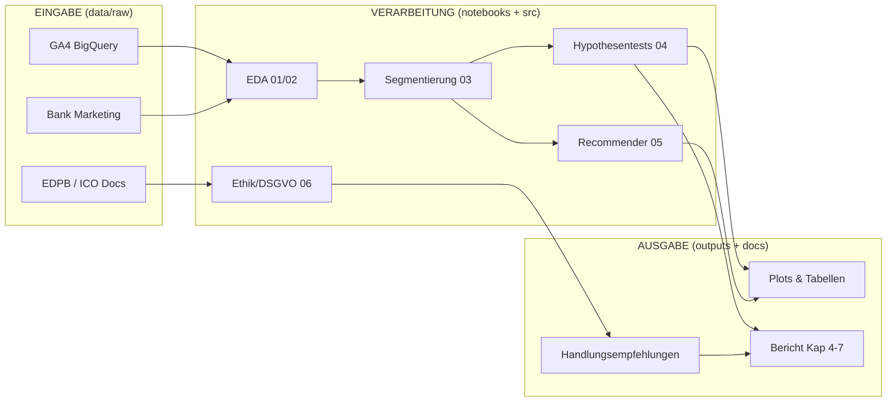

# Project Charter — KI-gestützte Personalisierung im Marketing

> Version: 1.0 | Stand: März 2026 | Status: FINAL
> SSOT für das gesamte Projekt — Änderungen nur per Team-Konsens

---

## 1. Forschungsfrage

> **"Inwieweit kann KI-gestützte Personalisierung im Marketing die Relevanz und Conversion von Kundenansprache erhöhen, ohne datenschutzrechtliche und ethische Grenzen zu überschreiten?"**

---

## 2. Hypothesen

### H1 — Conversion
**Aussage:** Personalisierte Ansprache (segment-spezifisch) erzielt signifikant höhere Response-Raten als generische Massenkommunikation.

- **Datensatz:** UCI Bank Marketing (Zielvariable: `y` = Kampagnen-Response)
- **Test:** Chi²-Test / t-Test auf Response-Rate je Segment vs. Gesamt
- **Erfolgsmetrik:** p < 0.05 + Cohen's d oder Cramér's V > 0.1
- **Notebook:** `04_hypothesis_testing.ipynb`

### H2 — Relevanz
**Aussage:** Verhaltensbasierte Segmentierung verbessert die Treffsicherheit von Produktempfehlungen messbar.

- **Datensatz:** GA4 BigQuery Sample (Session-/Transaktionsdaten)
- **Test:** Silhouette-Score Cluster-Qualität + Precision@K im Recommender-Vergleich
- **Erfolgsmetrik:** Silhouette > 0.3; Precision@5 segmentiert > Precision@5 ungrouped
- **Notebook:** `03_segmentation_analysis.ipynb`, `04_hypothesis_testing.ipynb`

### H3 — Grenze
**Aussage:** Ab einem bestimmten Grad der Individualisierung (detailliertes Profiling) entstehen DSGVO-konforme Risiken, die den Mehrwert überwiegen.

- **Datensatz:** EDPB Profiling Guidelines + ICO Guidance (qualitativ)
- **Methode:** Konzeptionelle Risikoanalyse, Profiling-Stufenmodell, Rechtsgrundlagen-Matrix
- **Erfolgsmetrik:** Definierter Schwellenwert ("Personalisierungsgrad-Score") mit Rechtsrisiko-Mapping
- **Notebook:** `06_ethics_dsgvo_analysis.ipynb`

---

## 3. Scope

### In Scope
- Digitales Marketing: E-Commerce, Display, Direct/E-Mail
- Kundensegmentierung (RFM, Clustering), Produktempfehlungen, CTR-Optimierung
- Regulatorik: DSGVO (Art. 4 Nr. 4, Art. 22), EDPB Profiling Guidelines (WP 251), ICO Guidance
- Explorative Datenanalyse + konzeptionelle ML-Logik (kein Produktionssystem)

### Out of Scope
- Offline-Kanäle (Stationärhandel, Print, TV)
- RTB/Programmatic Advertising im technischen Detail
- Rechtsräume außerhalb EU/UK (kein CCPA, kein PIPL)
- Vollständige ML-Produktionsimplementierung (kein Deployment, kein Monitoring)

---

## 4. Datenquellen

| Datensatz | Typ | Hypothese | Pfad | Lizenz |
|-----------|-----|-----------|------|--------|
| **GA4 BigQuery Sample Ecommerce** | Verhaltensdaten | H2 | `data/raw/ga4_ecommerce/` | Google Public Data |
| **UCI Bank Marketing** | Kampagnendaten | H1, H2 | `data/raw/bank_marketing/` | CC BY 4.0 |
| **EDPB Profiling Guidelines (WP 251)** | Regulatorik | H3 | `data/external/` | öffentlich |
| **ICO Guidance on Profiling** | Regulatorik | H3 | `data/external/` | öffentlich |
| **MIND (optional)** | Recommender | H2 | `data/raw/mind/` | MS Research License |

### Datenfit-Checkliste

- [ ] GA4: Session-Daten vorhanden (`event_name`, `ecommerce`, `user_pseudo_id`)
- [ ] GA4: Transaktionsdaten vorhanden (`purchase`-Events mit Produktdaten)
- [ ] Bank Marketing: Zielvariable `y` (yes/no) vorhanden
- [ ] Bank Marketing: Demografische + Kampagnen-Features vorhanden
- [ ] Kein PII in verarbeiteten Daten (`data/processed/`)
- [ ] Alle Datensätze in `docs/data_dictionary_template.md` dokumentiert

---

## 5. EVA-Architektur

```
EINGABE                      VERARBEITUNG                    AUSGABE
──────────────────────────────────────────────────────────────────────
GA4 Ecommerce Sessions   →   RFM-Berechnung              →  Segmente (Cluster-Labels)
                         →   KMeans-Clustering            →  Silhouette-Score (H2)
                         →   Recommender-Logik            →  Precision@K (H2)

Bank Marketing CSV       →   Feature Engineering          →  Segment-Response-Raten
                         →   Gruppenvergleich (Chi²/t)    →  p-Wert, Effektstärke (H1)

EDPB + ICO Docs          →   Profiling-Stufenmodell       →  Risiko-Score-Matrix (H3)
                         →   Rechtsgrundlagen-Analyse     →  Handlungsempfehlungen
```



---

## 6. Rollen & Verantwortlichkeiten

| Person | Primär-Aufgaben | Sekundär |
|--------|----------------|----------|
| **A** | EDA (`01`, `02`), Segmentierung (`03`), Hypothesentests (`04`) | Review Bericht Kap. 4–5 |
| **B** | Recommender-Logik (`05`), Data Dictionary, Daten-Setup + Preprocessing | Review Bericht Kap. 6 |
| **C** | DSGVO-Analyse (`06`), Berichtsschreiben (Kap. 1–3, 7–9), QA-Checkliste | Review Code Person A |

### Kommunikationsregeln
- **Sync:** 2× / Woche (Montag + Donnerstag, 30 min)
- **Async:** Kommentare in GitHub Issues oder direkt in Notebook-Zellen
- **Blockaden:** sofort melden — nicht bis zum nächsten Sync warten
- **Commits:** immer mit `[scope]`-Prefix, kein Direktpush auf `main`
- **Branch-Strategie:** `feature/person-X-beschreibung` → PR → Review → merge

---

## 7. Milestones

### M1 — Woche 1 (KW 13) — Foundation
**Ziel:** Alle wissen, mit welchen Daten sie arbeiten, erste Erkenntnisse sichtbar.

- [ ] Daten lokal abgelegt und ladbar
- [ ] `01_eda_ga4_ecommerce.ipynb` — Abgeschlossen
- [ ] `02_eda_bank_marketing.ipynb` — Abgeschlossen
- [ ] `docs/data_dictionary_template.md` — Ausgefüllt (Person B)
- [ ] `docs/project_charter.md` — Von allen gereviewed und abgenickt

**Gate:** EDA-Erkenntnisse in 5-Minuten-Standup präsentierbar

---

### M2 — Woche 2 (KW 14) — Analysis
**Ziel:** H1 und H2 testbar, Recommender-Prototyp läuft.

- [ ] `03_segmentation_analysis.ipynb` — Cluster + Silhouette-Score
- [ ] `04_hypothesis_testing.ipynb` — H1-Test mit p-Wert, H2-Metrik
- [ ] `05_recommendation_logic.ipynb` — Baseline-Recommender konzeptionell
- [ ] Bericht Kap. 4 + 5 (Methodik + EDA) — Draft (Person A/B)
- [ ] Zwischenpräsentation vorbereitet

**Gate:** H1 und H2 sind entweder bestätigt oder widerlegt + Begründung

---

### M3 — Woche 3 (KW 15) — Finalisierung
**Ziel:** Vollständiger Bericht, alle Hypothesen bearbeitet, Präsentation ready.

- [ ] `06_ethics_dsgvo_analysis.ipynb` — H3 + Risiko-Matrix
- [ ] Bericht Kap. 1–3, 6–9 fertig (Person C)
- [ ] `docs/qa_checklist.md` — Alle Gates grün
- [ ] Alle Notebooks durchlaufen sauber von oben nach unten
- [ ] Abgabe-ZIP / Repo-Link fertig

**Gate:** QA-Checkliste vollständig abgehakt

---

## 8. Risiken & Mitigationen

| Risiko | Wahrscheinlichkeit | Impact | Mitigation |
|--------|--------------------|--------|------------|
| GA4 Sample-Daten zu begrenzt für Clustering | Mittel | Hoch | Fallback: Bank Marketing für H2 verwenden |
| DSGVO-Analyse bleibt zu oberflächlich | Mittel | Hoch | EDPB-Dokumente direkt zitieren, Stufenmodell nutzen |
| Daten nicht rechtzeitig verfügbar (M1) | Niedrig | Hoch | Person B ist Data-Owner, lädt bis Tag 3 hoch |
| Scope-Creep durch "echte ML-Implementierung" | Mittel | Mittel | Scope-Reminder: konzeptionell reicht für Abschlussprojekt |
